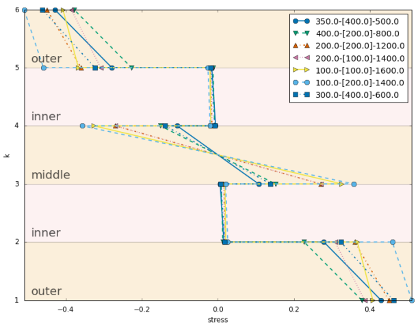

# LamAna

An extensible Python package for laminate analysis

## Installation

Install [Anaconda](https://www.continuum.io/downloads), then simply run:

    > conda install numpy pandas matplolib
    > pip install lamana

See the [documentation](http://lamana.readthedocs.io/en/stable/installation2.html) for alternative installation methods.
