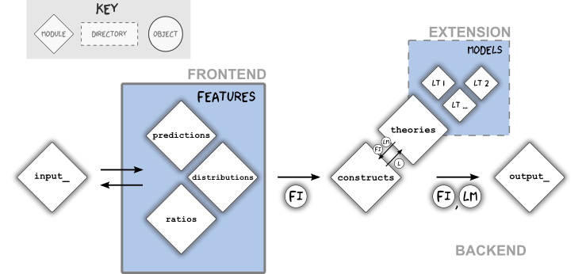

.. code:: python

    # TimeStamp
    import time, datetime
    st = datetime.datetime.fromtimestamp(time.time()).strftime('%Y-%m-%d %H:%M:%S')
    print('Last Run: {}'.format(st))

.. parsed-literal::

    Last Run: 2016-01-14 14:15:10
    

Lamana Overview (Detailed)
==========================

The Package Architecture
------------------------

The current package stems from a simple legacy script (circa 2014). It
has since been updated and currently abstracted with a focus to analyze
more general laminated problems.

The repository is extensibily designed for various geometry constructs
given a specified, customized model. This design architecture is
diagrammed below.

   API Diagram
As shown, each diamond represents a module. The diagram illustrates
their relationships in passing objects between modules. The user-related
areas are highlighted blue. The component of the lamana project can be
distinguished in three types:

-  Frontend: user-interacted, feature modules of particular interest
   that utilize laminate theory models
-  Extension: directories/modules extending capabilities of the
   repository, e.g. ``models`` directory containing user defined
   laminate theories (``Classical_LT``, ``Wilson_LT``).
-  Backend: remaining modules, ``input_``, ``constructs_``,
   ``theories_``, ``output_``; workhorse facotries of LaminateMOdel
   objects.

The project is extensible in part by adding new *Features* modules that
integrate with the existing backend. *"Feature"* modules are the
frontend of the repo because they are what users interact wih most.

However for simplicity, the core modules and features will coexist
within a single directory. The package file structure can be reviewed
`on GitHub <https://github.com/par2/lamana/tree/develop/>`__. The first
measure of sucess for this package is generating reproducibile results
of stress ``distributions`` module. Since ``distributions`` was the
first feature module developed, it will be the default rerfence this
documentation.

.. note ::

    This project is forked from legacy code: Script - Laminate_Stress_Constant_Thickness_3a3.ipynb.

