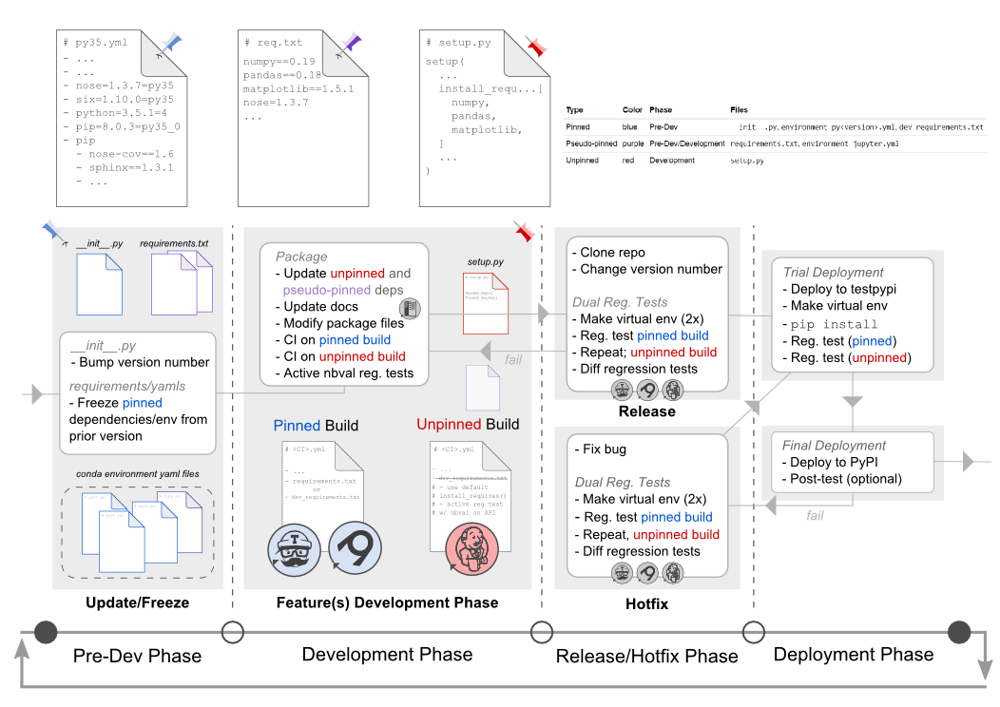

Contains

conda environment yaml files to frozen, pinned dependencies from Pre-Dev phase.
Be mindful of pinned vs. psuedo-pinned files.

Moved to folder in 0.4.13-dev
- Environment files for rebuilding conda envs.
- py34 was not used; included prior to dev env update
- jupyter yaml intiates kernels with `nb_conda_kernel`
